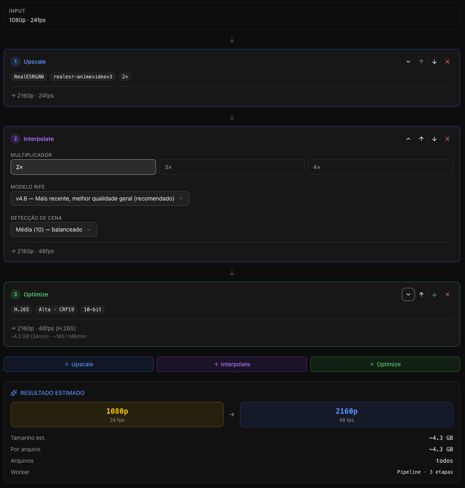
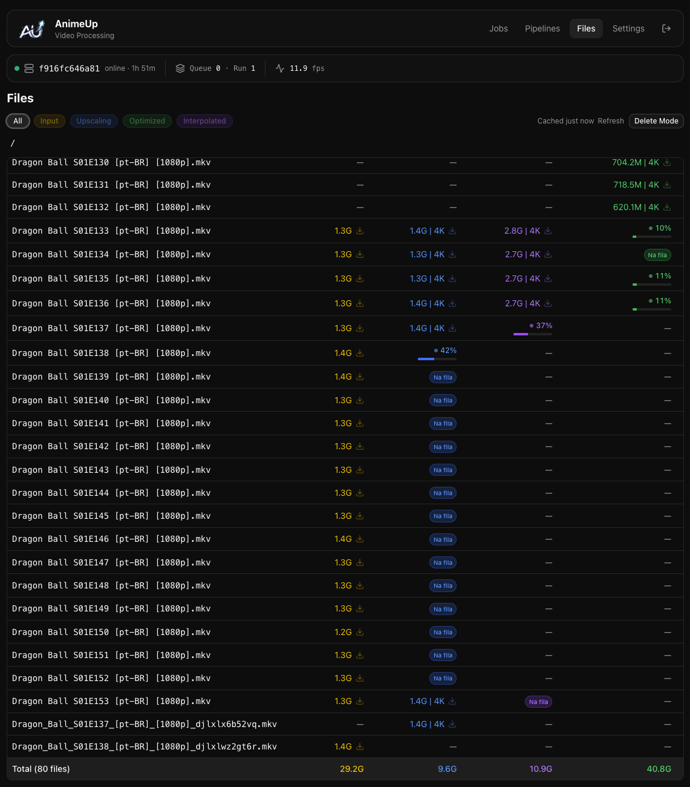

<div align="center">
  

  <h1>Anime Upscaling</h1>

  <p>Self-hosted web UI and HTTP API for managing anime video processing jobs — upscaling, frame interpolation, optimization, and integrity checks — powered by video2x and FFmpeg.</p>

  <p>
    <a href="https://github.com/IvanMicai/anime-upscaling/actions/workflows/ci.yml"></a>
    <a href="LICENSE"></a>
    
    
    
    
    
  </p>
</div>

---

## Table of Contents

- [Introduction](#introduction)
- [Features](#features)
- [Screenshots](#screenshots)
- [Models](#models)
  - [Upscale models](#upscale-models)
  - [Interpolation models (RIFE)](#interpolation-models-rife)
  - [Codecs, presets and audio](#codecs-presets-and-audio)
- [Operations](#operations)
- [Requirements](#requirements)
- [Quick Start](#quick-start)
- [Configuration](#configuration)
- [Pipelines](#pipelines)
- [Development](#development)
- [Documentation](#documentation)
- [Credits](#credits)
- [License](#license)

## Introduction

Anime Upscaling is a self-hosted dashboard for a local media workstation or home
server. You drop source files into a folder, queue jobs from the browser, and the
API container runs video2x + FFmpeg with GPU acceleration. Built for the common
case of restoring and re-encoding anime episodes in bulk, with reusable pipelines
that chain upscaling, interpolation and re-encoding in a single run.

Everything stays on your machine — no cloud, no telemetry, no per-minute pricing.
The UI is a Next.js app behind a password gate; the API is Go, exposed only on
the Compose network.

## Features

- Web dashboard for jobs, logs, files, settings and saved pipelines.
- Go API that runs video2x and FFmpeg workers inside the API container.
- Reusable pipelines: chain upscale + interpolate + optimize as one job.
- GPU health monitor with NVIDIA driver wedge detection.
- Live log streaming per job, with per-step progress and ETA.
- File explorer with natural-sort episode ordering across deep folder trees.
- Configurable concurrency: GPU streams and FFmpeg worker count per host.
- Optional hardware-encoded output (NVIDIA / AMD / Intel) for `optimize` jobs.
- Docker Compose deployment with a generic default and an NVIDIA GPU overlay.
- Portainer-friendly stack file for one-click deploys on home servers.
- Storybook for the UI component library (`packages/app`).

## Screenshots

| Pipeline editor | File picker |
| :---: | :---: |
|  |  |

## Models

Three upscale processors are wired in via video2x, plus the full RIFE family for
frame interpolation. Pick a processor first, then a model — only some model/scale
combinations are valid (the UI enforces this, see
[`pipeline.go`](packages/api/internal/pipeline/pipeline.go) for the source of
truth).

### Upscale models

| Processor | Model | Scales | Best for |
| --- | --- | :---: | --- |
| `realesrgan` | `realesr-animevideov3` | 2x · 3x · 4x | Anime video — fastest realesrgan variant |
| `realesrgan` | `realesrgan-plus-anime` | 4x | Stylised anime — higher quality, slower |
| `realesrgan` | `realesrgan-plus` | 4x | Live action / photographic content |
| `libplacebo` (Anime4K v4) | `anime4k-v4-a` · `…-a+a` | 2x · 3x · 4x | Lightweight shader — restores fine lines |
| `libplacebo` (Anime4K v4) | `anime4k-v4-b` · `…-b+b` | 2x · 3x · 4x | Balanced shader — general anime |
| `libplacebo` (Anime4K v4) | `anime4k-v4-c` · `…-c+a` | 2x · 3x · 4x | Sharp shader — CGI and flat colors |
| `libplacebo` (Anime4K v4) | `anime4k-v4.1-gan` | 2x · 3x · 4x | GAN shader — highest quality of the family |
| `realcugan` | `models-se` | 2x · 3x · 4x | Standard edition — general purpose |
| `realcugan` | `models-pro` | 2x · 3x | Pro — more detail preservation |
| `realcugan` | `models-nose` | 2x | No-denoise — preserves film grain |

**When to use which processor:**

- **RealESRGAN** — pure neural upscaler. Best raw quality for anime video,
  highest VRAM cost.
- **Anime4K (libplacebo)** — GPU shaders, very fast and lightweight, runs
  comfortably alongside other workloads. Good when you need to upscale a whole
  season overnight.
- **RealCUGAN** — middle ground. Strong on stylised content and gives the most
  control over denoise behaviour via the `models-*` variants.

### Interpolation models (RIFE)

All RIFE generations are accepted by the API:

`rife` · `rife-HD` · `rife-UHD` · `rife-anime` · `rife-v2` · `rife-v2.3` ·
`rife-v2.4` · `rife-v3.0` · `rife-v3.1` · `rife-v4` · `rife-v4.25-lite` ·
`rife-v4.25` · `rife-v4.26` · `rife-v4.6`.

For modern anime, `rife-v4.6` is a sensible default. `rife-v4.25-lite` is a good
trade-off for older / lower-resolution sources.

### Codecs, presets and audio

| Category | Values |
| --- | --- |
| Video codec | `libx265`, `libx264`, `libvpx-vp9`, `copy` |
| Audio codec | `copy`, `aac`, `libopus`, `libmp3lame` |
| Quality preset | `ultra` (CRF 16), `alta` (CRF 19), `media` (CRF 22), `baixa` (CRF 26) |
| Encoder speed | `ultrafast` → `veryslow` (x264/x265 standard ladder) |
| Tune | `none`, `animation`, `film`, `grain`, `zerolatency` |
| Pixel format | `yuv420p`, `yuv420p10le`, `yuv444p` |
| Hardware encoder | `nvidia`, `amd`, `intel` (set via `GPU_VENDOR`) |

## Operations

Each job — and each step inside a pipeline — has an operation type:

| Operation | What it does |
| --- | --- |
| `upscale` | Runs video2x with the chosen processor + model + scale. |
| `interpolate` | Runs RIFE to multiply the frame rate (2x, 3x, 4x…). |
| `optimize` | Re-encodes with the chosen codec, CRF preset and audio settings. |
| `integrity check` | Probes the file with FFmpeg to confirm it decodes end-to-end. |

## Requirements

- Docker and Docker Compose.
- For NVIDIA acceleration: a working NVIDIA driver and the
  [NVIDIA Container Toolkit](https://docs.nvidia.com/datacenter/cloud-native/container-toolkit/install-guide.html).
- For local development: Go 1.26+, Node.js 24 LTS, and pnpm 10.

## Quick Start

### Try it in one command (CPU, prebuilt images)

```bash
make quickstart
```

This generates a strong `AUTH_SECRET` and a random `AUTH_PASSWORD` into `.env`,
creates the media folders, and starts the stack from prebuilt Docker Hub images
(no local build). It prints the generated password at the end; open the web app
at [http://localhost:4750](http://localhost:4750) and log in with it.

Re-running `make quickstart` is safe — it never overwrites a password you have
already set.

### Build from source

To build the images locally instead of pulling them — for development, or to
run on a GPU:

```bash
cp .env.example .env
mkdir -p data/input data/output data/optimized data/interpolated data/temp
```

Edit `.env` before exposing the app outside your machine. Generate the secret
with `openssl rand -hex 32` and paste the output:

```bash
AUTH_PASSWORD=replace-this-password
AUTH_SECRET=replace-with-the-output-of-openssl-rand-hex-32
```

Start the app without a GPU reservation:

```bash
docker compose up -d --build
```

Start with the NVIDIA GPU profile:

```bash
docker compose -f docker-compose.yml -f docker-compose.nvidia.yml up -d --build
```

For a fast Portainer setup, paste `docker-compose.portainer.yml` into a new
stack and set the required environment variables. See
[docs/DEPLOYMENT.md](docs/DEPLOYMENT.md#portainer-stack) for details.

Put source videos in `data/input`. Outputs are written to `data/output`,
`data/optimized`, or `data/interpolated`, depending on the job or pipeline.

You can also use the Makefile helpers:

```bash
make quickstart   # secrets + folders + start from prebuilt images (CPU)
make init         # generate secrets + create media folders only
make run          # build locally and start (CPU)
make run-gpu      # build locally and start with the NVIDIA overlay
make logs
make stop
```

## Security Notes

The public port should be the Next.js app only. The API is intentionally exposed
only to the Compose network by default. Do not publish the API port directly to
the internet.

The built-in app authentication is a simple single-password gate for self-hosted
use. Put the service behind HTTPS, a VPN, or a trusted reverse proxy if you run
it outside a private network.

## Configuration

The main environment variables are documented in `.env.example`.

| Variable | Default | Description |
| --- | --- | --- |
| `HOST_PROCESS_DIR` | `./data` | Host directory containing media folders. |
| `PROCESS_DIR` | `/data` | Container path where media is mounted. |
| `APP_PORT` | `4750` | Public web app port. |
| `API_PORT` | `4751` | Internal API port. |
| `AUTH_PASSWORD` | `change-me` | Password for the web app. Replace it. |
| `AUTH_SECRET` | `change-me…` | Secret used to derive the session cookie. Replace it. |
| `GPU_COUNT` | `1` | Number of GPU slots exposed to the worker queue. |
| `STREAMS_PER_GPU` | `1` | Concurrent video2x streams per GPU. |
| `FFMPEG_STREAMS` | `1` | Concurrent FFmpeg workers. |
| `GPU_VENDOR` | _empty_ | Hardware encoder vendor: `nvidia`, `amd`, `intel`, or empty. |
| `API_MEM_LIMIT` | `16g` | Docker memory cap for the API container. |
| `APP_MEM_LIMIT` | `1g` | Docker memory cap for the Next.js container. |

## Pipelines

A pipeline is a named, ordered sequence of steps stored as JSON. Build them in
the UI (Pipelines → New) by chaining `upscale`, `interpolate` and `optimize`
steps; each step keeps its own model, scale, quality and codec settings. When a
job runs the pipeline, intermediate files land in the matching `data/*` folder
and the final output is delivered to `data/output`.

Pipelines are useful for a deterministic "process this whole season" workflow:
one click queues every episode through the same chain, with progress and ETA
reported per step.

## Development

API:

```bash
cd packages/api
go test ./...
go run ./cmd/animeup serve
```

App:

```bash
cd packages/app
pnpm install
pnpm dev
pnpm lint
pnpm build
```

From the repository root:

```bash
make dev
```

## Documentation

- [Architecture](docs/ARCHITECTURE.md)
- [Deployment guide](docs/DEPLOYMENT.md)
- [Releasing guide](docs/RELEASING.md)
- [API reference](packages/api/README.md)
- [App notes](packages/app/README.md)
- [Contributing](CONTRIBUTING.md)
- [Code of Conduct](CODE_OF_CONDUCT.md)
- [Security](SECURITY.md)

## Credits

This project stands on the shoulders of giants. The processing pipeline wraps:

| Project | Role | Link |
| --- | --- | --- |
| [video2x](https://github.com/k4yt3x/video2x) | Upscale orchestration | k4yt3x/video2x |
| [FFmpeg](https://ffmpeg.org/) | Decoding, encoding, muxing | ffmpeg.org |
| [Real-ESRGAN](https://github.com/xinntao/Real-ESRGAN) | RealESRGAN models | xinntao/Real-ESRGAN |
| [Anime4K](https://github.com/bloc97/Anime4K) | GPU shaders (libplacebo) | bloc97/Anime4K |
| [Real-CUGAN](https://github.com/bilibili/ailab/tree/main/Real-CUGAN) | RealCUGAN models | bilibili/ailab |
| [RIFE](https://github.com/megvii-research/ECCV2022-RIFE) | Frame interpolation | megvii-research/ECCV2022-RIFE |
| [rife-ncnn-vulkan](https://github.com/nihui/rife-ncnn-vulkan) | RIFE Vulkan runtime | nihui/rife-ncnn-vulkan |
| [Next.js](https://nextjs.org/) | Web app framework | vercel/next.js |
| [shadcn/ui](https://ui.shadcn.com/) | UI component library | shadcn-ui/ui |
| [Go](https://go.dev/) | API runtime | go.dev |

## Star History

<a href="https://star-history.com/#IvanMicai/anime-upscaling&Date">
  
</a>

## License

MIT. See [LICENSE](LICENSE).
